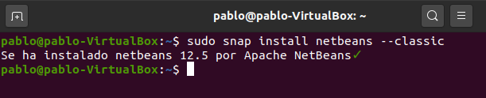
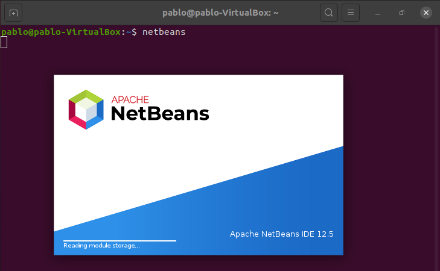

# Instalación del IDE Netbeans 12
## Indice
- **[1. Requisitos](#requisitos)**
- **[2. Instalación](#instalacion)**
- **[3. Ejecución](#ejecución)**
### Requisitos
Para poder comenzar con la práctica necesitaremos tener instalado Java para que el IDE Netbeans pueda funcionar correctamente, aunque si no está instalado java lo podremos pero no funcionará.	A modo de comprobación de que tenemos el java instalado deberemos usar el comando **“java -version”**.

### Instalación
Para la instalación de Netbeans usaremos los paquetes snap que nos permitirán descargar el IDE de una manera más fluida y sin errores. Puede ocurrir un error en la instalación del paquete , sin embargo el problema puede ser que no tengas instalado snap para comprobarlo usaremos el comando **“snap -version”**, si no aparece nada, para solucionar esto simplemente usaremos el siguiente comando **“sudo apt install snapd”**.
El comando que usaremos para instalar Netbeans es **“sudo snap install netbeans --classic”**. 

### Ejecución
Para poder ejecutar el programa de Netbeans bastará con, en el terminal, poner **“Netbeans”** de esta manera se nos abrirá la pantalla de inicio del programa.

